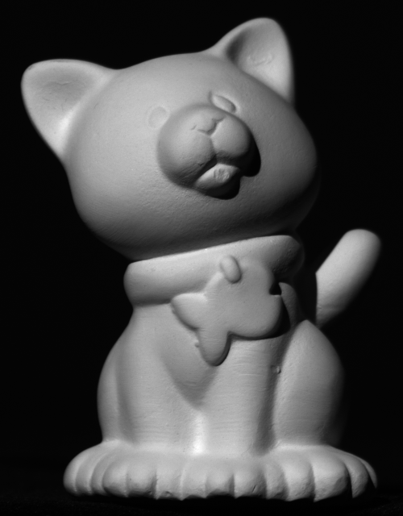
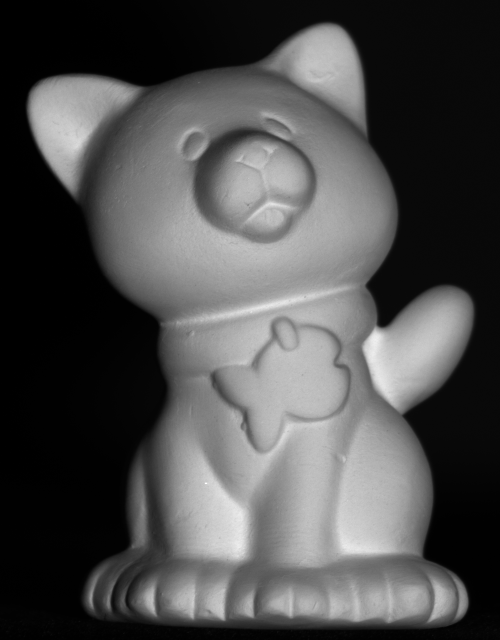
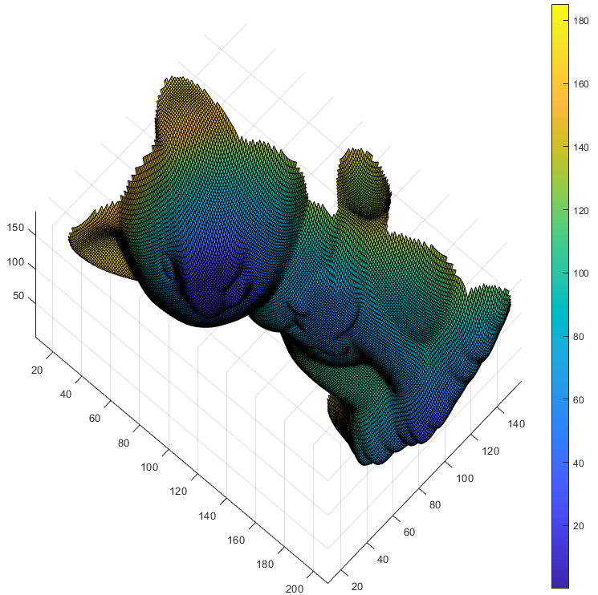

# About
This repo was made by Niklas Sandén and Gustav Nilsson Gisleskog as part of the course **Project in Applied Mathematics** at Lund University. It is an implementation of photometric stereo based on a paper by Hideki Hayakawa ("Photometric stereo under a light source with arbitrary motion". In: *Journal of the Optical Society of America* 11.11 (1994), pp. 3079–3089), along with our own additions. The project was supervised by Associate Professor Carl Olsson. 

# Photometric stereo
Photometric stereo is a technique that, given images of an object under different lighting conditions, tries to find the object's surface normals and 3D structure. In this project, we use images like the ones below, where there is only a single light source, but its intensity and angle varies between images.

    
    

After running the code, you will get a 3D plot showing the object's estimated surface. Below is an example of this:

    

A detailed description of how our system works can be found in [report.pdf](https://github.com/niklassanden/Photometric-Stereo/blob/main/report.pdf), but below is a summary of the important steps in the algorithm:

1. Extract illuminated pixels from the different frames.

2. Use singular value decomposition to get an initial solution of normals and light sources. 

3. Assuming that the surface has constant albedo, update the initial solution to better fit the assumption.

4. At this point the normals are provided in an arbitrary coordinate system. Rotate them so that they are aligned with the camera coordinate system.

5. Use the normals to calculate the gradients of the surface depth.

6. Integrate the gradients to get the depth values.

# How to run
To run the algorithm, run [main.m](https://github.com/niklassanden/Photometric-Stereo/blob/main/src/main.m) from the **Photometric-Stereo** directory with the normal Matlab editor. The standard object to perform the algorithm on is the cat, but you can change it to any of the objects that exist in the **PSDATA** directory. When asked whether you want to switch directory to **src** or add it to the path, you should add it to the path. 

Then you will get a screen where you are asked to point out pixels where the normals should point in certain directions relative to the camera. 3 images appear, and to select a normal you can click at a pixel in any one of them. First click on a point where the normal is pointing straight towards the camera. Then click a point where the normal is pointing to the right. It's allowed to point partially towards the camera, but should not point at all up, down or left. Lastly click on a point where the normal is pointing more down than up.

After this, you will get a few figures with information about the estimated surface normals, depth map and a 3D plot of the object.

# Acknowledgements
We would like to thank Carl Olsson for his support and guidance throughout the project.

The data was taken from https://vision.seas.harvard.edu/qsfs/Data.html.